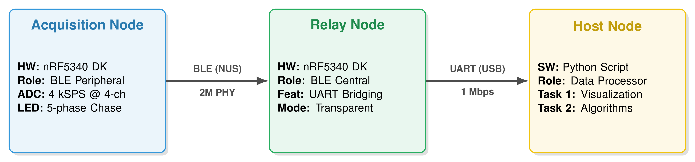
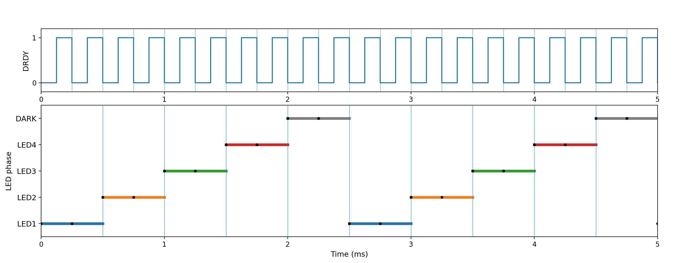
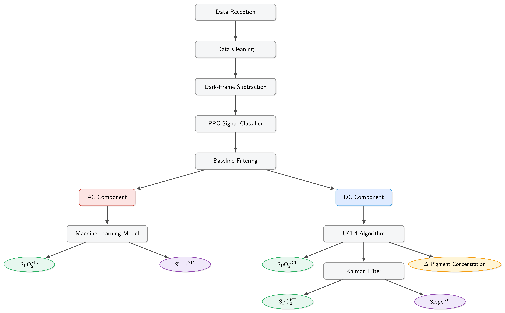

# 1. Overview

This project builds an end-to-end wearable monitoring platform that combines **multi-wavelength optical sensing (PPG/NIRS)** and **bioelectrical signals (ExG)** within a synchronized acquisition framework. The system covers the full pipeline—from embedded multi-channel sampling and time-multiplexed illumination control, to host-side signal quality assessment, dual-path SpO₂ estimation, and trend prediction. A key design goal is **robustness in real-world conditions**, achieved through **quality-aware fusion** between model-based and ML-based estimators.

# 2. Key Contributions

- **Synchronized acquisition node**: nRF5340 DK + ADS1298 for multi-channel physiological sampling (PPG + ExG) at **4 kSPS**.
- **Deterministic illumination multiplexing**: 4 wavelengths + dark state, controlled by MOSFETs; illumination is **sample-synchronous** using ADS DRDY.
- **Three-node architecture** for throughput/stability: Acquisition node → **Relay node (BLE→UART bridge)** → Host (Python).
- **Host analytics stack**: decoding/cleaning → dark subtraction → multi-branch quality classification → AC/DC separation → dual-path SpO₂ estimation → quality-aware fusion → Kalman smoothing → **SpO₂ + slope (trend)**.
- **Measured performance**: BLE throughput **416 kbps** with **0% packet loss**, typical latency **10 ms** (max **20 ms**); LED switching precision **±0.25 ms**; sampling clock **±50 µs**; end-to-end timestamp accuracy **±3 ms**.

# 3. System Architecture

The platform is organized as three cooperating nodes:

1. **Acquisition Node (wearable transmitter)**  
   Built around **nRF5340 DK** (dual-core BLE SoC) and **ADS1298** (multi-channel AFE). ADS1298 samples one channel connected to a photodiode (PPG), while the remaining channels acquire ExG signals (e.g., EMG/ENG/EEG). The node also controls four LED wavelengths (and a dark state) through MOSFET switching.

2. **Relay Node (BLE-to-UART bridge)**  
   A dedicated relay receives data over **BLE** and forwards it to the host via **UART**. This design helps overcome practical limitations of PC BLE stacks—where connection parameters (e.g., interval constraints around ~30 ms in many setups) can cap throughput and increase latency. By using an embedded relay as the BLE endpoint, the system can run more aggressive BLE parameters and keep the PC-side link simple and reliable (UART).

3. **Host Node (Python)**  
   The host performs data decoding, cleaning, signal processing, quality assessment, estimation, and visualization. The final outputs include SpO₂, quality indicators, and trend metrics, as well as synchronized PPG + ExG streams for further analysis.

*Figure 1: Three-node system architecture: Acquisition (nRF5340 + ADS1298 + LED driver) → Relay (BLE reception + UART forwarding) → Host (Python analytics).*

# 4. LED Illumination & Sampling Logic

Multi-wavelength PPG is implemented via **time-division multiplexing (TDM)** across **four LED wavelengths plus a dark state**. Illumination switching is **locked to ADS1298 DRDY** (data-ready) to guarantee sample-synchronous timing:

- **ADS1298 produces one DRDY per sample**, and the photodiode channel is sampled **at every DRDY**.
- The LED state (λ1, λ2, λ3, λ4, dark) changes **every two DRDY events** (i.e., two samples per state).
- Because the ADC samples every DRDY regardless of wavelength, the **host-side pipeline performs the final demultiplexing/selection**, mapping each photodiode sample to its illumination state and reconstructing per-wavelength PPG streams.

This approach makes the timing deterministic and allows robust background correction: the dark state provides a reference for offset/ambient components, which supports downstream **dark subtraction** and improves stability.

*Figure 2: Sample-synchronous LED multiplexing using ADS1298 DRDY: photodiode is sampled every DRDY; illumination state (λ1–λ4 + dark) changes every two DRDY.*

# 5. Host-side Processing Pipeline

The host pipeline receives data from the relay over UART, then runs a structured processing workflow:

1. **Reception → decoding → cleaning**
2. **Dark subtraction** for PPG
3. **Quality assessment with three branches** (waveform class, noise class, noisy-segment localization)
4. **Filtering + AC/DC decomposition**
5. **Dual-path SpO₂ estimation + trend**
   - **DC path (model-based)**: DC → UCL4 → SpO₂ → Kalman Filter (KF) → SpO₂ + slope
   - **AC path (ML-based)**: AC → ML model → SpO₂ + slope
6. **Quality-aware fusion**: Weights the KF and ML outputs based on the signal quality score from the classifier.
   - **High Quality**: Favors the ML model's output.
   - **Low Quality**: Favors the UCL4-based KF output.
7. **Final Output**: A comprehensive set of metrics including SpO₂, slope trends, and chromophore concentration changes.

The end result is a robust SpO₂ estimate, an interpretable quality score, and a trend indicator usable for monitoring scenarios.

*Figure 3: Algo flow: Quality-aware fusion of model-based (UCL4+KF) and ML-based estimators.*

# 6. Performance & Validation

### Test Setup
- **Input stimulus**: sinusoidal signals generated by a function generator; correctness validated on local visualizer.
- **Environment**: indoor lab with typical **Wi‑Fi** and **Bluetooth** interference.
- **Distance**: **2–3 m** between BLE endpoints.
- **Payload**: **4 channels × 24-bit** at **4 kSPS**.
- **Duration**: **>20 minutes** continuous streaming per run.

### Key Metrics
- **BLE Link**: 416 kbps throughput, 0% packet loss, ~10ms latency (max 20ms).
- **Timing**: LED switching ±0.25 ms, Sampling clock ±50 µs, End-to-end timestamp ±3 ms.
- **Sync**: Inter-channel synchronization error is 0 (frame-aligned).

# 7. Outputs

- **Per-wavelength reconstructed PPG streams** (plus dark reference).
- **Quality indicators**: global score + localized noisy segments.
- **SpO₂ estimates**: Final **quality-aware fused output** (blending ML and UCL4+KF estimates).
- **Chromophore concentration changes**: Real-time monitoring of ΔC_HbO2 and ΔC_Hb.
- **Trend**: SpO₂ slope (short-term tendency) for predictive monitoring.
- **Synchronized ExG channels** aligned to the same acquisition timeline.

# 8. Roadmap

Future work will focus on finalizing the development and verification of the algorithmic pipeline, systematically validating the overall platform in practical application scenarios, and extending multimodal interpretation strategies to establish a tighter coupling between oxygenation metrics and ExG dynamics.
